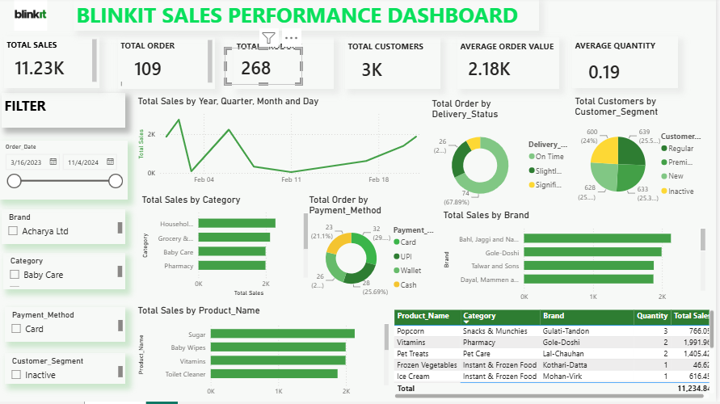

Blinkit Sales Performance Dashboard

 📌 Project Overview
This Power BI dashboard analyzes Blinkit sales performance using interactive visualizations and KPIs to uncover business insights and support data-driven decision-making.

 📊 Key Features
- Total Sales Analysis
- Average Sales
- Average Rating
- Item-wise Sales
- Outlet Performance
- Fat Content Analysis
- Interactive Filters

 🛠 Tools Used
- Power BI
- Excel/CSV
- DAX
- Power Query

 📁 Dataset
Blinkit sales dataset containing product, outlet, and customer information.

 📷 Dashboard Preview
()

 📈 Business Insights
- Top-performing outlet types
- Best-selling product categories
- Sales trends and customer preferences
- Actionable business recommendations
